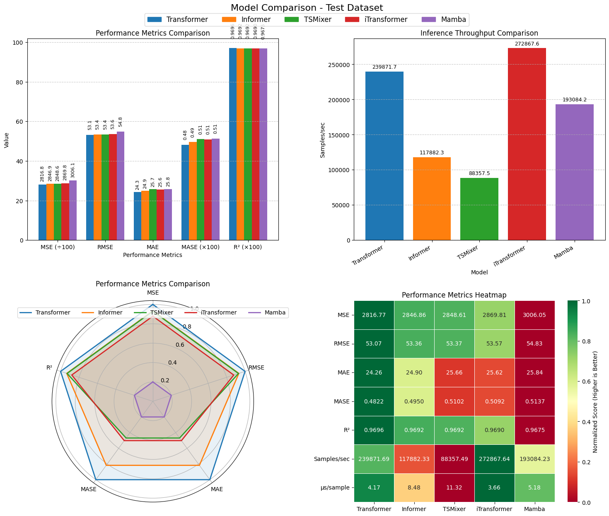
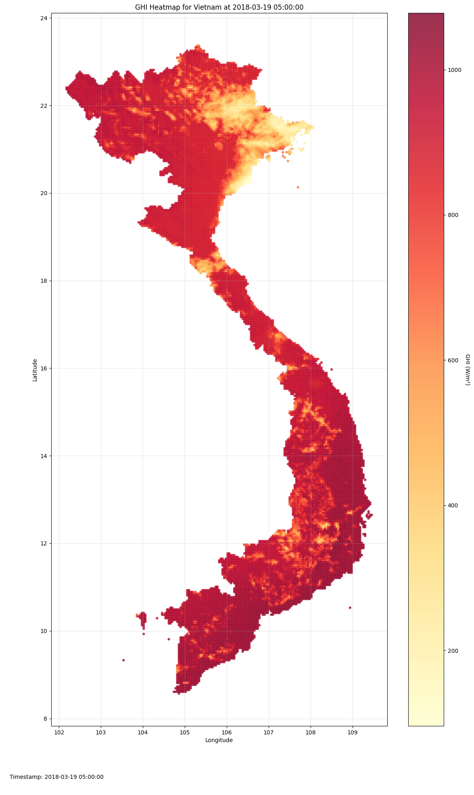
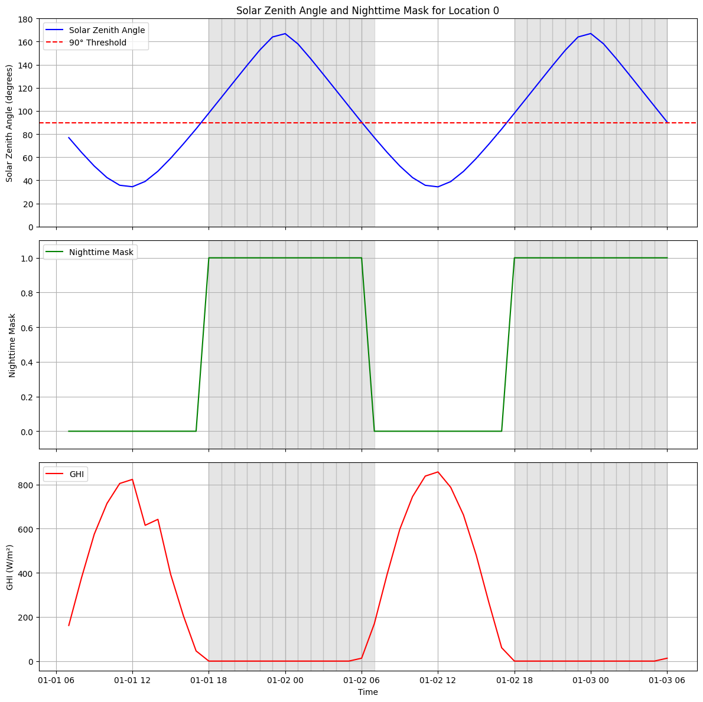
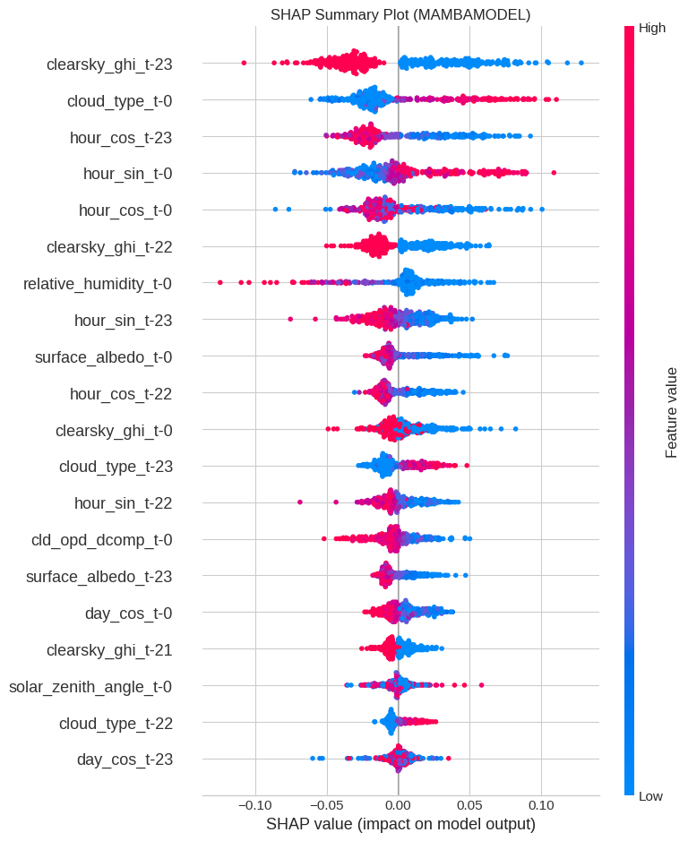
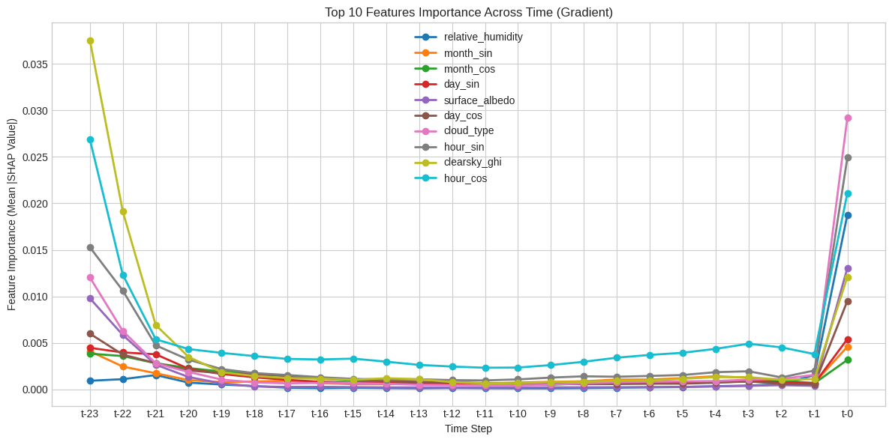

# Global Horizontal Irradiance Forecasting


***Abstract:** This research aims to develop an accurate and efficient deep learning approach for forecasting Global Horizontal Irradiance (GHI) to facilitate better integration of solar energy into existing power grids. The models leverage satellite data from the National Solar Radiation Database (NSRDB) to predict short-term solar irradiance patterns, enabling more reliable renewable energy planning and management. The study demonstrates how advanced AI techniques can address critical challenges in sustainable energy deployment while maintaining computational efficiency.*

Available models:
1. LSTM
2. 1D-CNN
3. CNN-LSTM
4. MLP
5. [TCN](https://arxiv.org/abs/1803.01271)
6. [Transformer](https://arxiv.org/abs/1706.03762)
7. [Informer](https://arxiv.org/abs/2012.07436)
8. [TSMixer](https://arxiv.org/abs/2303.06053)
9. [iTransformer](https://arxiv.org/abs/2310.06625)
10. [Mamba](https://arxiv.org/abs/2312.00752)

Supported exploration techniques:
1. Model Explainability: SHAP, Sensitivity Analysis
2. Model Compression: Quantization, Pruning, Knowledge Distillation

<p align="center">
  
</p>
<p align="center">
Comparison of advanced models in terms of RMSE, MAE, R², MASE, and inference throughput.
</p>

You can get the experiment runs from below Weights & Biases project:
- Weight & Biases: https://wandb.ai/tin-hoang/EEEM073-Solar-Radiation


## 0. Project Structure

- `data/`: Contains the raw and processed datasets
  - `raw/`: Original data downloaded from NSRDB
  - `processed/`: Preprocessed data ready for model training
- `models/`: Model architecture code for all models implemented in this project.
- `utils/`: Utility functions for data processing and model evaluation, e.g. data loading, training loop, model evaluation, plotting, etc.
- `plots/`: Visualization outputs will be saved here.
- `explainability/`: Outputs of model explainability will be saved here.
- `checkpoints/`: Saved model checkpoints during training will be saved here.
- `scripts/`: Python scripts for each corresponding notebook folder to run without Jupyter notebooks.

## 1. Installation

See `requirements.txt` for the list of dependencies.

Recommended Python version: >= 3.10

This codebase was developed and tested on below specifications (Surrey Otter lab machine):
```
- Operating System: Ubuntu 22.04.2 LTS
- Kernel: Linux 5.15.0-113-generic
- Python: 3.11.11
- NVIDIA GPU: NVIDIA RTX A4000 (16GB)
- CPU: 13th Gen Intel(R) Core(TM) i9-13900 (24 cores, 32 threads)
```

Install the dependencies by running:

### Option 1: Install all dependencies (required NVIDIA GPU)

This requires NVIDIA GPU.
```
pip install -r requirements.txt

```

### Option 2: Install dependencies for CPU only

This does not require NVIDIA GPU.
However, the training and inference speed is significantly slower, and you can not run model compression techniques with ONNX GPU runtime on FP16 in notebook `5_model_compression.ipynb`.
```
pip install -r requirements_cpu.txt
```


## 2. Get the data

### Option 1: Download the data from NSRDB by yourself
Follow the instructions in `1_data_exploration_and_download.ipynb` to filter and download the raw data from NSRDB.

Then, run `2_data_preprocessing.ipynb` to preprocess the data for modelling.

### Option 2: Download the filtered and preprocessed data
OR, you can conveniently download the NSRDB Himawari 7 data for Ho Chi Minh City in 10 years (2011-2020) by the following Google Drive links:
- Raw data: https://drive.google.com/file/d/1U1RQHxjY50E8aTbF6RBiP08I-kvS6RSN/view?usp=sharing
- Processed data: https://drive.google.com/file/d/1Wjyt_oK4q9au4g6QtTcaxZ3734i5U953/view?usp=sharing

## 3. Notebook Files

To start the JupyterLab server, run:
```
jupyter lab
```

This project is organized as a series of Jupyter notebooks that guide you through the entire workflow:

### 1. Data Exploration and Download (`1_data_exploration_and_download.ipynb`)
- **Objective**: Explore the National Solar Radiation Database (NSRDB) and download relevant data.
- **Inputs**:
    - NREL API key (for direct HSDS access, optional if using pre-downloaded links).
    - Target location (Ho Chi Minh City, Vietnam).
    - Target years (2011-2020).
- **Key Steps**:
    - Connect to HSDS to access NSRDB data.
    - List available datasets, fields, and metadata.
    - Explore geographical coverage (countries, states/provinces like "Hồ Chí Minh").
    - Visualize GHI data via heatmaps and time series plots for the specified region.
    - Download raw solar radiation data for Ho Chi Minh City for the years 2011-2020.
- **Outputs**:
    - Raw NSRDB data files (e.g., `himawari7_YYYY_Hồ-Chí-Minh.h5`) saved to the `data/raw/` directory.
    - Console output of data exploration steps.
    - Plots visualizing GHI data (displayed in the notebook).

<p align="center">
  
</p>
<p align="center">
GHI map of Vietnam at specific time.
</p>


### 2. Data Preprocessing (`2_data_preprocessing.ipynb`)
- **Objective**: Load raw data, perform feature engineering, normalization, and split into train/validation/test sets.
- **Inputs**:
    - Raw NSRDB data files from `data/raw/` (e.g., `himawari7_YYYY_Hồ-Chí-Minh.h5`).
    - List of selected features for modeling.
    - Target variable name (GHI).
- **Key Steps**:
    - Load raw H5 files for Ho Chi Minh City.
    - Select relevant features (e.g., 'air_temperature', 'wind_speed', 'cloud_type', 'solar_zenith_angle', 'clearsky_ghi').
    - Engineer time-based features (sine/cosine transformations for hour, day, month, day of week).
    - Compute a nighttime mask based on solar zenith angle.
    - Calculate clear sky GHI if not present.
    - Normalize selected features and the target variable.
    - Split data chronologically: Training (2011-2018), Validation (2019), Test (2020).
- **Outputs**:
    - Processed (normalized and feature-engineered) data files saved in `data/processed/`:
        - `train_normalized_<timestamp>.h5`
        - `val_normalized_<timestamp>.h5`
        - `test_normalized_<timestamp>.h5`
    - Scaler objects used for normalization, saved as a pickle file in `data/processed/` (e.g., `scalers_<timestamp>.pkl`).
    - Plots visualizing raw data and engineered features (displayed in the notebook).

<p align="center">
  
</p>
<p align="center">
Supported Daytime and Nighttime masks, crucial for the GHI evaluation.
</p>

### 3. AI Modeling - Basic Approach (`3a_ai_modelling_basic.ipynb`)
- **Objective**: Implement, train, and evaluate several foundational deep learning models for GHI forecasting.
- **Inputs**:
    - Processed data files (`train_normalized_<timestamp>.h5`, `val_normalized_<timestamp>.h5`, `test_normalized_<timestamp>.h5`) from `data/processed/`.
    - Scaler file (`scalers_<timestamp>.pkl`) from `data/processed/`.
    - Model hyperparameters (lookback window, batch size, learning rate, etc.).
- **Key Steps**:
    - Load preprocessed datasets and scalers.
    - Implement basic models: LSTM, 1D-CNN, CNN-LSTM, MLP, TCN.
    - Train each model using the training set and validate on the validation set.
    - Evaluate model performance on the test set using metrics like MSE, RMSE, MAE, R², MASE (including daytime/nighttime breakdown).
    - Log experiments and results to Weights & Biases (if enabled).
- **Outputs**:
    - Trained model checkpoints saved to the `checkpoints/` directory (e.g., `LSTM_best_<timestamp>.pt`).
    - Plots visualizing training history, evaluation metrics, and GHI predictions saved to `plots/` and displayed in the notebook.
    - JSON file with model performance metrics saved in `plots/` (e.g., `basic_model_metrics_<timestamp>.json`).
    - Experiment tracking data on Weights & Biases (if enabled).

### 4. AI Modeling - Advanced Approach (`3b_ai_modelling_advanced.ipynb`)
- **Objective**: Implement, train, and evaluate more sophisticated deep learning architectures.
- **Inputs**:
    - Processed data files and scalers from `data/processed/`.
    - Model hyperparameters.
- **Key Steps**:
    - Load preprocessed datasets and scalers.
    - Implement advanced models: Transformer, Informer, TSMixer, iTransformer, Mamba.
    - Train and evaluate these models using the same pipeline as the basic approach.
    - Log experiments and results to Weights & Biases (if enabled).
- **Outputs**:
    - Trained model checkpoints for advanced models saved to `checkpoints/` (e.g., `Transformer_best_<timestamp>.pt`).
    - Plots visualizing training history, evaluation metrics, and GHI predictions saved to `plots/` and displayed in the notebook.
    - JSON file with advanced model performance metrics saved in `plots/` (e.g., `advanced_model_metrics_<timestamp>.json`).
    - Experiment tracking data on Weights & Biases (if enabled).

### 5. Model Explainability (`4_explainability.ipynb`)
- **Objective**: Apply explainability techniques (SHAP, Sensitivity Analysis) to understand model predictions.
- **Inputs**:
    - A trained model checkpoint from `checkpoints/` (e.g., a Mamba model).
    - Processed training and test data files from `data/processed/`.
    - Scaler file from `data/processed/`.
    - Configuration parameters for explainability methods (e.g., number of samples, SHAP algorithm).
- **Key Steps**:
    - Load the trained model, data, and scalers.
    - Focus on explaining daytime predictions from the test set.
    - Apply SHAP (KernelSHAP or GradientSHAP) to calculate feature importance.
    - Generate SHAP summary plots, waterfall plots for individual predictions, and temporal importance plots.
    - Perform sensitivity analysis by perturbing input features and observing output changes.
- **Outputs**:
    - SHAP visualization plots saved to the `explainability/` directory (e.g., summary, waterfall, temporal importance plots).
    - Sensitivity analysis bar chart and a CSV file with sensitivity scores saved to `explainability/`.
    - Console output and plots displayed in the notebook.


<p align="center">
  
</p>
<p align="center">
SHAP summary plot for a Mamba model.
</p>

<p align="center">
  
</p>
<p align="center">
SHAP temporal analysis plot for a Mamba model.
</p>


### 6. Model Compression (`5_model_compression.ipynb`)
- **Objective**: Apply and evaluate model compression techniques (Quantization, Pruning, Knowledge Distillation) to reduce model size and potentially improve inference speed.
- **Inputs**:
    - A trained model checkpoint (e.g., Transformer model) from `checkpoints/`.
    - Processed data files and scalers from `data/processed/`.
    - Configuration parameters for each compression technique.
- **Key Steps**:
    - **Quantization**:
        - Export the model to ONNX format.
        - Apply Int8, Int4 (CPU), and FP16 (GPU) quantization using ONNX Runtime.
        - Evaluate quantized models for size, latency, and accuracy.
    - **Structured Pruning**:
        - Apply structured pruning (e.g., channel-wise for Linear layers) at various sparsity levels.
        - Evaluate pruned models.
    - **Knowledge Distillation**:
        - Define a smaller "student" model.
        - Train the student model using a "teacher" (the original larger model) to guide its learning.
        - Train a similar student model from scratch for comparison.
        - Evaluate distilled and scratch-trained student models.
- **Outputs**:
    - Compressed model checkpoints (PyTorch `.pt` and ONNX `.onnx` files) saved to `checkpoints/`.
    - Plots comparing the performance (accuracy, size, latency) of original and compressed models saved to `plots/`.
    - JSON file with compression model performance metrics saved in `plots/` (e.g., `compression_model_metrics_<timestamp>.json`).
    - Console output and plots displayed in the notebook.
    - Experiment tracking data on Weights & Biases (if applicable for student model training).

## 4. Alternative: Python Scripts (for running without Jupyter notebooks)

We also provide the Python scripts for each notebook in `scripts/` folder. Each notebook has a corresponding `.py` file with the same name that contains identical code.
These Python scripts allow you to conveniently run the workflow without using Jupyter notebooks:

- `1_data_exploration_and_download.py`
- `2_data_preprocessing.py`
- `3a_ai_modelling_basic.py`
- `3b_ai_modelling_advanced.py`
- `4_explainability.py`
- `5_model_compression.py`

To run the Python scripts, you can use the following command:
```
python scripts/<script_name>.py
```
